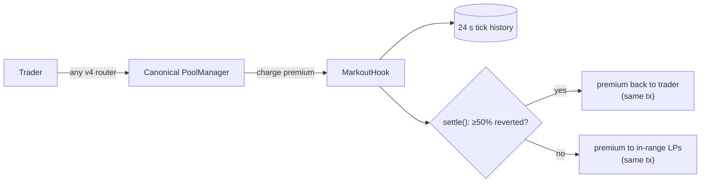
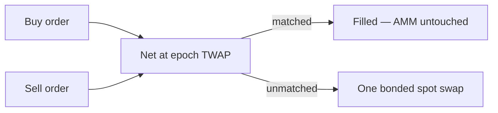

<div align="center">


# Markout

**One 24-second memory. Two lanes. LPs underwrite the quote.**

[](#testing--coverage)
[](#testing--coverage)
[](#testing--coverage)
[](#testing--coverage)
[](LICENSE)
[](https://docs.uniswap.org/contracts/v4/overview)
[](https://sepolia.etherscan.io/address/0x1e9a034b21ab19d00556b429c281f9b29d8bb0cc)
[](#deployed--proven-on-canonical-sepolia)
[](https://markout-nine.vercel.app)

**Launch the venue:** [markout-nine.vercel.app](https://markout-nine.vercel.app) · [Memory Console](https://markout-nine.vercel.app/app) · [Protocol Docs](https://markout-nine.vercel.app/docs)

**Demo video:** ▶️ https://youtu.be/2oOW-RyrMcc

</div>

---

## The problem

A volatile pair on an AMM has two bad options. Quote a tight fee and its liquidity providers bleed to **one-shot arbitrage** — a toxic trader swaps exactly once, snaps the pool to the global price, and leaves. There is no second trade to analyze, so every "continuation-flow" MEV filter waves it through. Or quote a wide fee and pay for that toxicity with **organic volume**, which quietly walks to the tighter venue next door.

Loss-versus-rebalancing is not an edge case here; it is the steady drip. And every existing answer drags luggage onboard: external oracles, private order flow, delayed execution, keeper dependencies, router allowlists — each one a partner a pool must trust, integrate, and pay.

**Markout needs none of that.** The pool already records everything required to judge toxicity — its own price. The hook simply gives that price a memory.

## The solution

Markout is a Uniswap v4 hook on the **canonical, shared Sepolia PoolManager** that turns a 24-second window of the pool's own price history into a market question, answered twice:

- **Spot lane — reversion insurance, priced by the pool itself.** Every swap fills instantly at 3 bps and escrows a **live-quoted premium** (starts at 20 bps, stepped ±by the pool's own settle history, clamped 5–60 bps). If at least half of that swap's own price impact reverted, the premium returns to the trader **inside the settlement transaction**. If it held, in-range LPs keep it — **credited in that same settlement transaction** whenever liquidity exists.
- **Batch lane — opt-in 24-second epochs on the same clock.** Traders queue a side with explicit custody; opposing orders net at the epoch's time-weighted average price and **never touch the AMM**. Only unmatched residual executes — as one ordinary bonded swap. A lone order is an honest one-epoch TWAP, not a coincidence-of-wants auction.

The premium is a **tax on one-shot toxicity, not an LVR hedge** — and the oracle is **entirely hook-local**: pool ticks plus the hook's own accumulator. `No partner integrations`: no oracle feeds, no private orderflow, no keepers required for correctness, no router allowlist.

### Architecture — the verdict



### Architecture — the batch lane



## What this buys you

| Seat | What Markout gives you |
|---|---|
| **LPs** | A volatile pair that quotes 3 bps without farming its own liquidity. Add or remove full-range positions through the **official PositionManager + Permit2**. Sustained informed flow pays a dividend into in-range liquidity **at settle**. |
| **Organic traders** | Instant fill. Post the live premium for 24 seconds; revert past half your own impact and it is refunded **in the settlement transaction**. Net cost: the 3 bps fee. |
| **Sandwich-sensitive flow** | The batch lane: exact two-sided nets never hit the curve — positioning inside an epoch is economically empty (proven by test). |
| **Integrators** | The premium rides the swap caller's own PoolManager delta. **Any router that can settle a normal v4 swap pays it with zero Markout-specific code.** No allowlist, no `settleFor`, no special call. |

## Deployed & proven on canonical Sepolia

All source-verified on Etherscan. Current cut: **2026-09-02 (two-lane)** — live bytecode is exactly this `src/`. Every earlier deployment is stale.

| Contract | Address | Notes |
|---|---|---|
| MarkoutHook | [`0x1e9A034b21aB19D00556B429C281F9B29d8Bb0cC`](https://sepolia.etherscan.io/address/0x1e9a034b21ab19d00556b429c281f9b29d8bb0cc) | The memory, both lanes |
| MarkoutBatchRouter | [`0xC9aaB8CaD29bE99A36653eC5A6d78278C84D4067`](https://sepolia.etherscan.io/address/0xc9aab8cad29be99a36653ec5a6d78278c84d4067) | Immutable child; residuals pay the premium lane |
| MarkoutRouter | [`0xf06737dcBa252D276deCC0f6f0F2102aD20c7535`](https://sepolia.etherscan.io/address/0xf06737dcba252d276decc0f6f0f2102ad20c7535) | Convenience only — never a gate |
| PoolManager | [`0xE03A1074c86CFeDd5C142C4F04F1a1536e203543`](https://sepolia.etherscan.io/address/0xe03a1074c86cfedd5c142c4f04f1a1536e203543) | Canonical, shared |
| Demo token0 (MDB) | [`0x41A9c2d06770375a41b94aBC94bcf0CD14320060`](https://sepolia.etherscan.io/address/0x41a9c2d06770375a41b94abc94bcf0cd14320060) | Capped faucet |
| Demo token1 (MDA) | [`0xae0Fe2707a76EC31AB64Dc29557bdBEE9f1A5F5A`](https://sepolia.etherscan.io/address/0xae0fe2707a76ec31ab64dc29557bdbee9f1a5f5a) | Capped faucet |

**Live proofs — our own transactions, every receipt status 1:**

1. **Refund at settle.** Spot buy [`0x2636c8c8…`](https://sepolia.etherscan.io/tx/0x2636c8c8df9b1dc7ede26555362f61af41b54f8b3adecdb4705dedac8740f9ff) + pre-signed 1.01× reversion landing in **exactly the next block (Δ = 12 s)** [`0x0e76a1cc…`](https://sepolia.etherscan.io/tx/0x0e76a1cc0f05473be6c4f479d3fd103a21d297c9b5fc7db880df6d3174f89c60) → `Settled(outcome 1 · Refunded)` **and** `RefundClaimed` in the same transaction [`0xe354716c…`](https://sepolia.etherscan.io/tx/0xe354716c3e82b3e3c20d4a99a69fe10683cc230d23f9cff4861180ed935a10ff)
2. **Donate credited at settle.** Unreversed single-shot swap [`0x1491a672…`](https://sepolia.etherscan.io/tx/0x1491a672f945c1a8bed55619aa86fdddcb841dd944b600929b9950401a579a0a) → `Settled(outcome 3 · Donated)` with **`DonationFlushed` inside the settle tx** — in-range LPs paid in the settlement itself [`0xda709887…`](https://sepolia.etherscan.io/tx/0xda7098878fae81aff0b38828ee8773baaa9069c6492ffb74867e66b46b95b189)
3. **Batch netting.** Pre-signed buy [`0x76ce04bf…`](https://sepolia.etherscan.io/tx/0x76ce04bf556e8c1c8d52021c27236c4827497121b5b94430cf509d87a45e275d) + value-paired sell [`0x19f6b896…`](https://sepolia.etherscan.io/tx/0x19f6b89604b55ddfe4a88836168237fbc18faa1816e080332bd378f051d381c5) in one epoch → `clearBatch` fills both sides at **one uniform TWAP** with a dust-bounded residual (0 on the buy side) [`0xdb3a18f6…`](https://sepolia.etherscan.io/tx/0xdb3a18f65e6207084b25c924082d21272c49228b3e2b018be01dc5d13ee30109)

## Try it

**Hosted: <https://markout-nine.vercel.app>** — Chrome desktop + MetaMask (or any injected wallet) on Sepolia.

- [`/`](https://markout-nine.vercel.app) — the **live memory tape** streams the pool with no wallet connected: the real `slot0` trace, the live premium, and the honest limits, on camera.
- [`/app`](https://markout-nine.vercel.app/app) — the full loop: mint capped demo tokens, **add/remove liquidity through the official PositionManager + Permit2**, trade spot and/or batch, watch the tape record *your* trade, settle it yourself. Refresh-safe: open trades recover from your own receipts. One-click demos run the refund, donate, and batch-net paths end-to-end.
- [`/docs`](https://markout-nine.vercel.app/docs) — the entire mechanism, honest limits included.

Local:

```shell
cd frontend && npm install && npm run dev
```

Terminal runbook — copy-pasteable against the live ABI, including the pre-signed next-block reversion pair and the batch-epoch clear: [`demo.md`](./demo.md).

## Testing & coverage

**55 tests, 0 failures**, invariant fuzz at 256 runs × 500 calls, and a canonical-Sepolia fork suite.

| Suite (`test/`) | Passed | Key guarantees proven | Contract coverage (lines) |
|---|---|---|---|
| `MarkoutEngine.t.sol` | 9 | `test_downImpact_frontier` · `test_upImpact_frontier` · `test_overshoot_refunds` · `testFuzz_decide_matchesReference` · `testFuzz_refundSetMonotoneTowardPre` | `MarkoutEngine.sol` **100%** |
| `Markout.t.sol` | 38 | `test_fullReverseNextBlock_refunds` · `test_bondPayable_genericRouter` · `test_bondPayable_attackerAuthoredRouter` · `test_delayedSettlement_matchesWindowClose` · `test_premiumQuote_matchesCharge_andStepper` · `test_arbSustains_creditsLpsAtSettle` · `test_lpDividend_beatsVanillaSameFee` · `test_atomicSandwich_sameBlock_frontLegRefunds_honestLimit` · `test_batch_exactNet_noAmmSwap` · `test_batch_partialNet_residualSwapAndUniformFills` · `test_batch_sandwichPositioning_isEmpty` · `test_batch_loneOrder_isOneEpochTwapBoundedByExecution` · `test_batch_lateClear_samePrice` · `test_hookData_beneficiaryRules` · `test_reentrancy_claimBlocked` · `test_nativePool_endToEnd` | `MarkoutHook.sol` **92.0%** · `MarkoutRouter.sol` **88.1%** · `MarkoutBatchRouter.sol` **87.2%** · `FaucetToken.sol` **100%** |
| `MarkoutFuzz.t.sol` | 5 | `invariant_escrowCovered` · `invariant_liabilityIdentity` · `invariant_verdictsImmutable` · `invariant_boundedRelease` · `invariant_batchCustodyCovered` | — |
| `MarkoutFork.t.sol` | 3 | `test_canonical_lifecycle_refund_and_donate` · `test_canonical_exactOut_bondFromRealizedInput` · `test_canonical_removeLiquidity_decreaseCloseTake` — on the real canonical PoolManager | — |

## Repository layout

```
src/        protocol contracts (hook, batch child, engine, router, base, faucet)
test/       four Foundry suites: unit+fuzz · integration+attack · invariant fuzz · canonical fork
script/     deployment + optional keeper (correctness never depends on it)
frontend/   the live instrument — /  ·  /app  ·  /docs
docs/       PRD (docs/prd/markout.md)
demo.md     terminal runbook against the live deployment
```

## License

[MIT](LICENSE) © 2026 Shreyas Sovani
